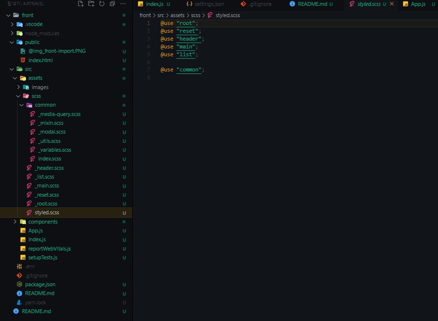

# 📌 Airtravel 규칙 
### ( 필요한 규칙들은 추가 해주시고 팀원들에게 공유해주세요! )

## Git

- Git Flow 기법 사용할 것
  ( 최대한 실무 느낌 내봅시당!! 혹시 투머치하다 싶으면 말해주세여!!!)

  ```
  소스트리에서 Git Flow 사용하기
    1. main 브랜치와 develop브랜치를 생성한다.
    2. 소스트리 우측 상단에 깃플로우 버튼을 누른다.
    3. 제품브랜치를 master 브랜치에서 main으로 바꾼다.
    4. 개발 브랜치를 develop 으로 설정해준 뒤 확인 버튼을 누른다.

    이후 모든 브랜치 생성 시엔 깃플로우 버튼을 눌러서 생성한다.

    Git bash로 사용하는 방법도 있으나 소스트리가 훨씬 간편하다..
  ```

  [Git Bash에서 Git flow 사용하기 가이드](https://hbase.tistory.com/60)

* branch는 기능 단위로 생성한다.
* commit 메시지는 **접두사 (#이슈번호): 작업내용** 으로 작성해주세요!! 
  ```
    예시) bugfix (#120): 프로필 변경 기능 사진 업로드 안됨 수정
  ```
* 기능 내용에 따른 접두사를 붙혀서 생성할 것.

  ```
    feature - 기능 추가
    chore - 스타일 등의 작업
    task - 주석 추가 및 삭제 줄정리 등의 단순 작업
    enhancement - 기능 개선 작업
    bugfix - 버그 수정 작업
  ```

---

<br />
<br />

## back-end ( 담당자 - 피수연, 전상혁 )

- 규칙을 추가해주세요

<br />
<br />

## front-end ( 담당자 - 김도은, 전상혁 )

- 클래스 작명 규칙은 BEM 방식을 따른다.

 <br />
 <br />

## 파일 규칙

1. 필요시 .vscode/setting.json에 editor 및 코드 정렬 등의 설정을 추가해주세요.

1. scss/styled.scss에 모든 .scss 파일 import해서 App.js에는 styled.scss만
   import하면 되도록 새로운 .scss 파일 추가 시 styled.scss에 @use로 import 해주세요.
1. styled.scss를 제외한 모든 .scss 파일은 이름 앞에 \_(언더바를 붙혀서 생성)

<br />


